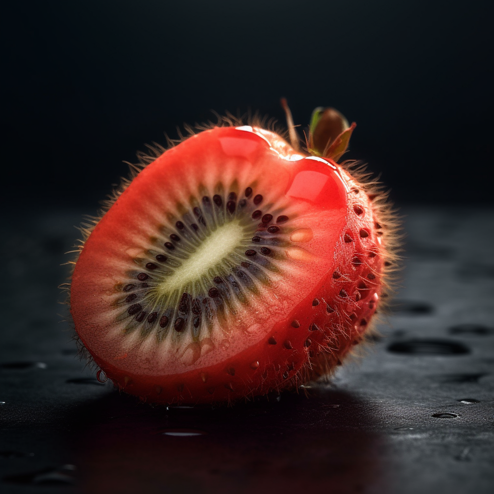

# Nesoulad

Pro tento úkol jsem zadala do MidJourney kombinaci jahody a kiwi a vznikla z toho věc, kterou bych nikdy nesnědla. Je zvláštní vidět jahodu, která je za prvé chlupatá (ty chlupy mi připomínají nějakého pavouka či housenku) a za druhé má ten zvláštní tmavý vnitřek.

Je zajímavé, že mi vždycky vyjely varianty červeného chlupatého ovoce, ale nikdy mi nevyjela například zelené kiwi s jahodovým vnitřkem.

